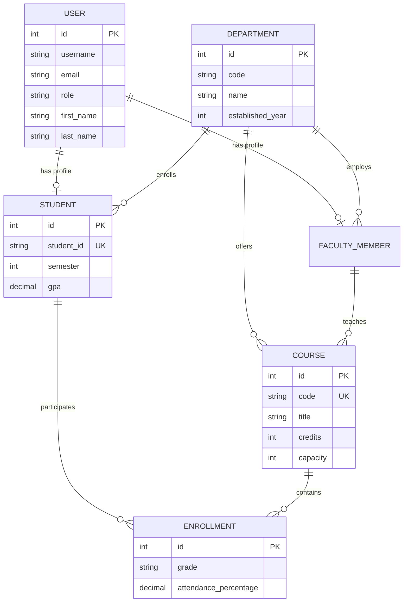

# Campus Management System — Architecture Overview

## 1. System Architecture

The Campus Management System is designed as a decoupled modern multi-tier application:

```
                  +--------------------------------+
                  |  Client Browser / User Device  |
                  +---------------+----------------+
                                  |
                                  | HTTP/HTTPS (Port 80/443)
                                  v
                  +--------------------------------+
                  |    Nginx Reverse Proxy Gateway |
                  +-------+----------------+-------+
                          |                |
             Static Assets|                | /api/* & /admin/*
             (SPA routes) |                |
                          v                v
            +-------------------+    +--------------------+
            | React + Bootstrap |    | Django REST (WSGI) |
            | Frontend (Port 80)|    | Backend (Port 8000)|
            +-------------------+    +---------+----------+
                                               |
                                               | SQL / ORM
                                               v
                                     +--------------------+
                                     |  PostgreSQL 16 DB  |
                                     +--------------------+
```

## 2. Technology Stack

| Layer | Technology | Key Libraries & Purpose |
|---|---|---|
| **Frontend** | React 18 + JavaScript | Vite, Bootstrap 5, Bootstrap Icons, Chart.js, React-Chartjs-2, Axios |
| **Backend** | Python 3.11 + Django 5 | Django REST Framework, SimpleJWT, django-cors-headers, Gunicorn |
| **Database** | PostgreSQL 16 | Relational data persistence with foreign keys and indexes |
| **Authentication** | JWT (JSON Web Tokens) | Stateless tokens with access (60m) & refresh (7d) rotation |
| **Testing** | Pytest + Django TestCase | `pytest-django`, fixtures, API client validation |
| **Deployment** | Docker & Nginx | Docker Compose multi-container setup with reverse proxy |

## 3. Database Schema Overview



## 4. Authentication Flow (JWT)

1. Client posts credentials (`username`, `password`) to `/api/auth/token/`.
2. Backend validates credentials and issues signed `access` and `refresh` JWT tokens.
3. React stores tokens and sends `Authorization: Bearer <access_token>` on subsequent API calls.
4. Axios response interceptor intercepts expired token errors (`401 Unauthorized`) and automatically calls `/api/auth/token/refresh/` using the refresh token.
